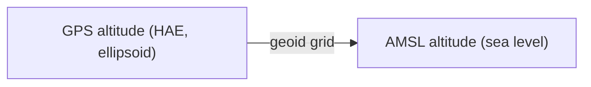

Terrain changes how high your drone or aircraft really is above the ground. Helix uses a **Digital elevation model (DEM)** to know the ground under each point of the flight, and **geoids** to convert altitudes between the GPS reference and sea level.

## Why terrain matters

The altitude mode of the flight decides which reference is used. You set it in the **VOL** tab of the **Tasks** panel, in the **Mode** field. In the interface, the tab is labelled **FLIGHT**.

| Mode | What it means | When to use it |
|---|---|---|
| **AMSL** | Altitude above sea level, constant along the path. | Flight at a constant altitude. |
| **AGL** | Height above the ground, following the terrain. | Drones only. |
| **iAGL** | Height above the ground, following the terrain. | Flight that must follow the ground. |

Helix refuses some combinations and tells you on screen:

- **AGL** mode is for drones only. For an aircraft, the screen offers **iAGL** or **AMSL**.
- If the **AMSL** altitude drops below the terrain of the area, Helix tells you. Raise the altitude, or switch to **AGL** or **iAGL**.

Without a DEM loaded for the area, the calculation cannot follow the terrain. Helix then shows the message **DTM unavailable**: zoom in on the area, then recalculate.

## Altitudes: AMSL and HAE

GPS measures altitude against a smooth mathematical surface, the **ellipsoid** (called **HAE**, for ellipsoidal height). This surface does not follow the sea or the shape of the land exactly. The **geoid** is the surface that follows the average sea level, and **AMSL** altitude is measured against it. The gap between the two changes from place to place, so a geoid grid lets you convert one into the other.

## Digital elevation model window

The window is titled **Digital elevation model** and lists the available terrain sources.

<Frame caption="The Digital elevation model (DEM) window">
  
</Frame>

### Available sources

- **Photorealistic tiles** (scope **Worldwide**): terrain taken from the 3D tiles of the map.
- **GLO30**, **SRTM1** and **High definition** (from 0.5 to 30 m): terrain models built into Helix.

The **Active DEMs** list shows the active sources. The label **Used for calculation** marks the one used for the calculation.

### Add a DEM

1. Click **Add a DEM** at the bottom of the window.
2. Enter a **DEM name**.
3. Choose the file. Helix accepts a raster, a point cloud or a **.hdem** pyramid.
4. For a point cloud, click **Classes…** to choose the classes to import.
5. Check the **CRS** field (coordinate reference system). Helix suggests it from the file.
6. Check the **Vertical reference**. It shows either "declared by the file" or "inferred from the file name".

During the import, Helix shows the steps: **Analysis**, **Read**, **Rasterization**, **Pyramid**, then **Save**. The message **DEM imported** confirms that the import is finished.

### Pre-download

To download the terrain of the flight area in advance, click **Pre-download AOI** at the bottom of the window. The button is greyed out until an area is ready.

{/* CAPTURE TO DO: Add a DEM window after a file is selected, showing DEM name, CRS and Vertical reference */}

## Settings → Geoids

Geoids are used to convert altitudes. You manage them in **Settings**, on the **Geoids** tab.

<Frame caption="Settings, Geoids tab: Manage button">
  
</Frame>

1. Open **Settings**, then the **Geoids** tab.
2. Click **Manage** in the **Vertical transformation grids** row.
3. The **Geoid grids** window opens. It shows how many grids are installed and how many are available in total.
4. Search for the grid of your work area in the search field (for example "Corse"), then download it.

If a grid is missing, Helix shows **Geoid not downloaded**. The calculation cannot convert altitudes until the grid is installed. Download it in this window, then recalculate the flight.

## Settings → Terrain cache

The terrain cache keeps terrain and basemap tiles on your computer. This means they do not have to be downloaded again each time you open the app.

<Frame caption="Settings, Terrain cache tab">
  
</Frame>

- **Current usage**: the space used, for example "617 KB / 5.0 GB". The **Purge cache** button empties the cache.
- **Cache folder**: the folder where the tiles are stored. **Browse** lets you choose another one, then **Save**.
- **Max cache size**: the limit in GB. The minimum is 2 GB. When the limit is reached, the oldest tiles are deleted automatically. Click **Save** after you change the value.

## See also

- [Basemaps and layers](/flight-planner/carte/fonds-et-couches)
- [Measuring on the map](/flight-planner/carte/mesures)
- [Altitude, GSD and speed (VOL tab)](/flight-planner/parametres/onglet-vol)
- [Quality control (QC)](/flight-planner/qualite/controle-qualite)
