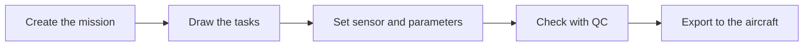

Helix Flight Planner is the desktop software for preparing an aerial survey mission. You draw the area to cover, choose the sensor and the flight settings, and the software calculates the flight strips. You then check the planned quality and export the plan to your aircraft.

It is built for operators, pilots and project managers who run surveys in **photogrammetry** or **LiDAR**, with a **drone**, an **airplane** or a **helicopter**.

<Frame caption="A mission with its area, its calculated flight strips and the Duration / Distance box">
  
</Frame>

## The typical workflow in 5 steps

<Steps>
  <Step title="Create a mission">
    Click **+ New mission**, enter a name, then optionally set the place. See [Create a mission](/flight-planner/missions/creer-une-mission).
  </Step>
  <Step title="Draw the tasks">
    In a flight, draw the area to cover with the **Draw area** tool, or add a corridor, a waypoint or an obstruction. See [Draw the tasks](/flight-planner/missions/taches).
  </Step>
  <Step title="Set the sensor and the parameters">
    In the **Tasks** panel, set the altitude, the GSD and the speed (**FLIGHT** tab), the sensor (**SENSOR** tab) and the overlap (**GEOMETRY** tab). The strips update. See [Altitude, GSD and speed](/flight-planner/parametres/onglet-vol).
  </Step>
  <Step title="Check with quality control">
    Open the **QC** panel to check the GSD and the thresholds for the mission. See [Quality control (QC)](/flight-planner/qualite/controle-qualite).
  </Step>
  <Step title="Export to the aircraft">
    Click **Export** and choose the flight plan format, or send it to **DJI Pilot**. See [Export the flight plan](/flight-planner/import-export/exporter).
  </Step>
</Steps>

## Explore the documentation

<CardGroup cols={2}>
  <Card title="Getting started" icon="rocket" href="/flight-planner/demarrage/premiere-mission">
    Sign in, your first mission in 10 minutes and a tour of the interface.
  </Card>
  <Card title="Missions" icon="map" href="/flight-planner/missions/tableau-de-bord">
    Dashboard, creating a mission, flights, tasks and splitting an area.
  </Card>
  <Card title="Flight parameters" icon="sliders" href="/flight-planner/parametres/bandes">
    Altitude, GSD, speed, sensor, overlap and flight strips.
  </Card>
  <Card title="Map" icon="layer-group" href="/flight-planner/carte/fonds-et-couches">
    Basemaps, layers, measurements, terrain (DEM), geoids and weather.
  </Card>
  <Card title="Quality control" icon="circle-check" href="/flight-planner/qualite/controle-qualite">
    Check the GSD and the thresholds before the flight.
  </Card>
  <Card title="Import and export" icon="right-left" href="/flight-planner/import-export/importer">
    Import data, export the flight plan and work with DJI.
  </Card>
  <Card title="Catalogs" icon="book" href="/flight-planner/catalogues/capteurs-et-appareils">
    Sensors and aircraft available in the software.
  </Card>
  <Card title="Help" icon="circle-question" href="/flight-planner/aide/faq">
    Frequently asked questions, troubleshooting and glossary.
  </Card>
</CardGroup>

## See also

- [Sign in](/flight-planner/demarrage/connexion)
- [Your first mission in 10 minutes](/flight-planner/demarrage/premiere-mission)
- [Discover the interface](/flight-planner/demarrage/interface)
- [Frequently asked questions and troubleshooting](/flight-planner/aide/faq)
