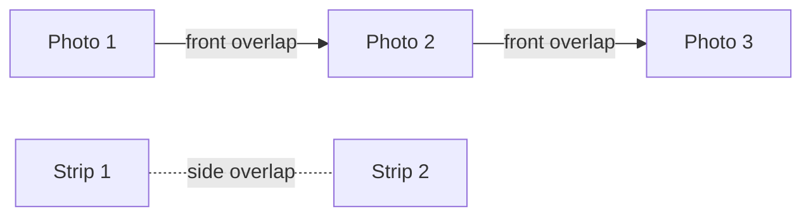

The **GEOMETRY** tab sets how the flight strips cover the area: how much the photos overlap, which direction the strips run in, and which margins are added around the area. This is where you adjust the density of the mission without changing the sensor or the altitude.

## How to open it

<Steps>
  <Step title="Select a task">
    Open the mission, then the flight you want from the flight tabs at the top. Click the task (the drawn area) in the **Tasks** panel.
  </Step>
  <Step title="Open the GEOMETRY tab">
    In the panel, click the **GEOMETRY** tab, to the right of **FLIGHT** and **SENSOR**.
  </Step>
  <Step title="Set the values">
    Type a value in the field, or move the slider when there is one. The strips on the map are recalculated with the new value.
  </Step>
</Steps>

<Frame caption="GEOMETRY tab">
  
</Frame>

## Front and side overlap

A drone does not take a single photo: it takes one every few meters, and the strips sit next to each other. The overlap is the share of each image that also appears in the next one. The higher the overlap, the more photos and the longer the mission, but the stitched result (the mosaic, the 3D model) is more solid.

| Field | What it sets | Unit | Default value shown |
|---|---|---|---|
| **Front overlap** | Overlap between two successive photos along the same strip | % | 80 % |
| **Side overlap** | Overlap between two neighboring strips | % | 60 % |

Simplified view of a strip:

<Note>
  Depending on the sensor type you pick in the **SENSOR** tab, the labels can change to **Front overlap (photo)**, **Side overlap (photo)** or **Side overlap (LiDAR)**. The role stays the same.
</Note>

## Direction and the AUTO button

- The **Direction** slider rotates the orientation of the strips over the area. The field to the right shows the angle, in degrees (**°**).
- The green **AUTO** button, next to **Direction**, lets Helix suggest the orientation.
- To set the orientation yourself, use the slider or the value field. Compare the results in the **Duration / Distance** box.

## AOI buffer and Overshoot

Both fields are in meters (**m**) and are **0** by default, so no margin is added:

- **AOI buffer**: margin around the drawn area.
- **Overshoot**: distance added beyond the ends of the strips.

## Double grid

The **Double grid** switch turns on a second set of strips. On the map, the strips then form a grid with two families of lines.

## Strict zone

The **Strict zone** switch fits the strips to the outline you drew. Check the map after you turn it on or off.

## Effect on the strips

After each change, the map updates and the **STRIPS** list changes:

- a higher overlap brings the strips closer together and increases their number;
- a margin (**AOI buffer**, **Overshoot**) extends the area covered by the strips;
- **Double grid** adds a second set of strips crossed with the first;
- **Strict zone** changes how the strips fit the outline.

Check the result in the **Duration / Distance** box and in the **STRIPS** list before you export the flight plan.

{/* CAPTURE À FAIRE : GEOMETRY tab with Double grid turned on and the crossed strips visible on the map */}

## See also

- [Altitude, GSD and speed (FLIGHT tab)](/flight-planner/parametres/onglet-vol)
- [Choose the sensor (SENSOR tab)](/flight-planner/parametres/onglet-capteur)
- [Flight strips](/flight-planner/parametres/bandes)
- [Quality control (QC)](/flight-planner/qualite/controle-qualite)
