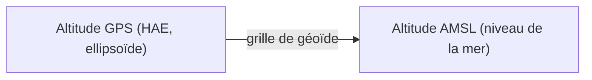

Le relief change l'altitude réelle de votre drone ou de votre avion au-dessus du sol. Helix utilise un **Modèle numérique d'élévation (MNT)** pour connaître le sol sous chaque point du vol, et des **géoïdes** pour convertir les altitudes entre la référence GPS et le niveau de la mer.

## Pourquoi le terrain compte

Le mode d'altitude du vol décide de la référence utilisée. Il se règle dans l'onglet **VOL** du panneau **Tâches**, champ **Mode** :

| Mode | Ce que cela veut dire | Quand l'utiliser |
|---|---|---|
| **AMSL** | Altitude au-dessus du niveau de la mer, constante sur le tracé. | Vol à altitude constante. |
| **AGL** | Hauteur au-dessus du sol, en suivant le relief. | Drones uniquement. |
| **iAGL** | Hauteur au-dessus du sol, en suivant le relief. | Vol qui doit suivre le terrain. |

Helix refuse certaines combinaisons et l'indique à l'écran :

- Le mode **AGL** est réservé aux drones. Pour un avion, l'écran propose **iAGL** ou **AMSL**.
- Si l'altitude **AMSL** passe sous le relief de la zone, Helix l'indique. Augmentez l'altitude, ou passez en mode **AGL** ou **iAGL**.

Sans MNT chargé sur la zone, le calcul ne peut pas suivre le relief. Helix affiche alors le message « MNT indisponible » : zoomez sur la zone, puis recalculez.

## Les altitudes : AMSL et HAE en trois phrases

Le GPS mesure une altitude par rapport à une surface mathématique lisse, l'**ellipsoïde** (on l'appelle **HAE**, hauteur ellipsoïdale). Cette surface ne suit pas exactement la mer ni les reliefs. Le **géoïde** est la surface qui suit le niveau moyen de la mer, et l'altitude **AMSL** se mesure par rapport à lui. Entre les deux, l'écart varie d'un endroit à l'autre : une grille de géoïde permet donc de convertir l'un en l'autre.

## Fenêtre Modèle numérique d'élévation

La fenêtre s'intitule **Modèle numérique d'élévation** et liste les sources de relief disponibles.

<Frame caption="La fenêtre Modèle numérique d'élévation (MNT)">
  
</Frame>

### Sources proposées

- **Tuiles photoréalistes** (portée **Mondial**) : relief issu des tuiles 3D de la carte.
- **GLO30**, **SRTM1** et **Haute définition** (de 0,5 à 30 m) : modèles de relief intégrés à Helix.

La liste **DEM actifs** indique les sources actives. La mention **Utilisé pour le calcul** signale celle qui sert au calcul.

### Ajouter un DEM

1. Cliquez sur **Ajouter un DEM** en bas de la fenêtre.
2. Donnez un **Nom du DEM**.
3. Choisissez le fichier. Helix accepte un raster, un nuage de points ou une pyramide **.hdem**.
4. Pour un nuage de points, cliquez sur **Classes…** pour choisir les classes à importer.
5. Vérifiez le champ **SCR** (système de coordonnées). Helix le propose à partir du fichier.
6. Vérifiez la **Référence verticale**. Elle est indiquée comme « déclarée par le fichier » ou « déduite du nom du fichier ».

Pendant l'import, Helix affiche les étapes : **Analyse**, **Lecture**, **Rastérisation**, **Pyramide** puis **Enregistrement**. Le message **DEM importé** confirme la fin.

### Téléchargement

Pour télécharger le relief de la zone du vol à l'avance, cliquez sur **Pré-télécharger AOI** au bas de la fenêtre. Le bouton est grisé tant qu'aucune zone n'est prête.

{/* CAPTURE À FAIRE : fenêtre Ajouter un DEM après sélection d'un fichier, avec Nom du DEM, SCR et Référence verticale */}

## Réglages → Géoïdes

Les géoïdes servent à convertir les altitudes. Ils se gèrent dans **Réglages**, onglet **Géoïdes**.

<Frame caption="Réglages, onglet Géoïdes : bouton GÉRER">
  
</Frame>

1. Ouvrez **Réglages**, puis l'onglet **Géoïdes**.
2. Cliquez sur **Gérer** dans la ligne **Grilles de transformation verticale**.
3. La fenêtre **Grilles de géoïdes** s'ouvre. Elle indique le nombre de grilles installées (**{n} local**) et le nombre disponible (**total**).
4. Téléchargez les grilles de la zone de travail depuis le **CDN**.

Si une grille manque, Helix affiche **Géoïde non téléchargé**. Le calcul ne peut pas convertir les altitudes tant que la grille n'est pas installée. Téléchargez-la dans cette fenêtre, puis recalculez le vol.

## Réglages → Cache terrain

Le cache terrain garde en local les tuiles de relief et de fond de carte. Cela évite de les retélécharger à chaque ouverture.

<Frame caption="Réglages, onglet Cache terrain">
  
</Frame>

- **Utilisation actuelle** : la place occupée, par exemple « 617 Ko / 5.0 Go ». Le bouton **Purger le cache** vide le cache.
- **Dossier de cache** : le dossier où sont stockées les tuiles. **Parcourir** permet d'en choisir un autre, puis **Sauver**.
- **Taille max du cache** : la limite en Go. Le minimum est de 2 Go. Quand la limite est atteinte, les tuiles les plus anciennes sont supprimées automatiquement. Cliquez sur **Sauver** après une modification.

## Voir aussi

- [Fonds de carte et couches](/fr/flight-planner/carte/fonds-et-couches)
- [Mesurer sur la carte](/fr/flight-planner/carte/mesures)
- [Altitude, GSD et vitesse (onglet VOL)](/fr/flight-planner/parametres/onglet-vol)
- [Contrôle qualité (QC)](/fr/flight-planner/qualite/controle-qualite)
