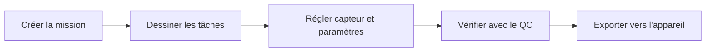

Helix Flight Planner est le logiciel de bureau pour préparer une mission de prise de vue aérienne : vous dessinez la zone à couvrir, vous choisissez le capteur et les réglages de vol, et le logiciel calcule les bandes de vol. Vous contrôlez ensuite la qualité prévue et vous exportez le plan vers votre appareil.

Il s'adresse aux opérateurs, pilotes et chefs de projet qui réalisent des relevés en **photogrammétrie** ou en **LiDAR**, avec un **drone**, un **avion** ou un **hélicoptère**.

<Frame caption="Une mission avec sa zone, ses bandes de vol calculées et l'encart Durée / Distance">
  
</Frame>

## Le parcours type en 5 étapes

<Steps>
  <Step title="Créer une mission">
    Cliquez sur **+ NOUVELLE MISSION**, donnez un nom, puis indiquez éventuellement le lieu. Voir [Créer une mission](/fr/flight-planner/missions/creer-une-mission).
  </Step>
  <Step title="Dessiner les tâches">
    Dans un vol, dessinez la zone à couvrir avec l'outil **Dessiner une zone**, ou ajoutez un corridor, un waypoint ou une obstruction. Voir [Dessiner les tâches](/fr/flight-planner/missions/taches).
  </Step>
  <Step title="Régler le capteur et les paramètres">
    Dans le panneau **Tâches**, réglez l'altitude, le GSD et la vitesse (onglet **VOL**), le capteur (onglet **CAPTEUR**) et le recouvrement (onglet **GÉOMÉTRIE**). Les bandes se mettent à jour. Voir [Altitude, GSD et vitesse](/fr/flight-planner/parametres/onglet-vol).
  </Step>
  <Step title="Vérifier avec le contrôle qualité">
    Ouvrez le panneau **QC** pour contrôler le GSD et les seuils de la mission. Voir [Contrôle qualité (QC)](/fr/flight-planner/qualite/controle-qualite).
  </Step>
  <Step title="Exporter vers l'appareil">
    Cliquez sur **EXPORT** et choisissez le format du plan de vol, ou envoyez-le vers **DJI Pilot**. Voir [Exporter le plan de vol](/fr/flight-planner/import-export/exporter).
  </Step>
</Steps>

## Explorer la documentation

<CardGroup cols={2}>
  <Card title="Démarrage" icon="rocket" href="/fr/flight-planner/demarrage/premiere-mission">
    Connexion, première mission en 10 minutes et découverte de l'interface.
  </Card>
  <Card title="Missions" icon="map" href="/fr/flight-planner/missions/tableau-de-bord">
    Tableau de bord, création de mission, vols, tâches et découpe de zone.
  </Card>
  <Card title="Paramètres de vol" icon="sliders" href="/fr/flight-planner/parametres/bandes">
    Altitude, GSD, vitesse, capteur, recouvrement et bandes de vol.
  </Card>
  <Card title="Carte" icon="layer-group" href="/fr/flight-planner/carte/fonds-et-couches">
    Fonds de carte, couches, mesures, terrain (MNT), géoïdes et météo.
  </Card>
  <Card title="Contrôle qualité" icon="circle-check" href="/fr/flight-planner/qualite/controle-qualite">
    Vérifier le GSD et les seuils avant le vol.
  </Card>
  <Card title="Import et export" icon="right-left" href="/fr/flight-planner/import-export/importer">
    Importer des données, exporter le plan de vol et travailler avec DJI.
  </Card>
  <Card title="Catalogues" icon="book" href="/fr/flight-planner/catalogues/capteurs-et-appareils">
    Capteurs et appareils disponibles dans le logiciel.
  </Card>
  <Card title="Aide" icon="circle-question" href="/fr/flight-planner/aide/faq">
    Questions fréquentes, dépannage et glossaire.
  </Card>
</CardGroup>

## Voir aussi

- [Se connecter](/fr/flight-planner/demarrage/connexion)
- [Votre première mission en 10 minutes](/fr/flight-planner/demarrage/premiere-mission)
- [Découvrir l'interface](/fr/flight-planner/demarrage/interface)
- [Questions fréquentes et dépannage](/fr/flight-planner/aide/faq)
