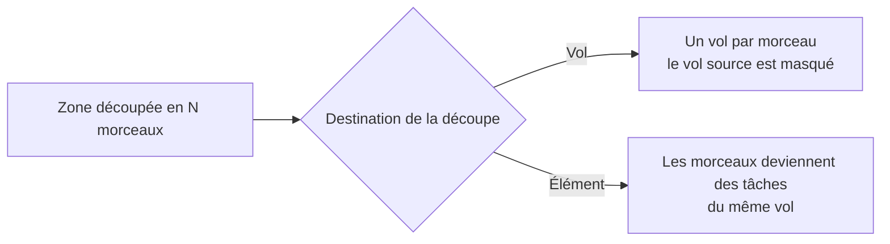

L'outil **Découpe multi-vol manuelle** coupe une zone en plusieurs morceaux à l'aide de lignes que vous tracez vous-même. Utilisez-le quand une zone est trop grande pour un seul vol, ou quand vous voulez la répartir entre plusieurs vols ou plusieurs tâches.

## Découper une zone pas à pas

<Steps>
  <Step title="Sélectionner la zone">
    Cliquez sur la zone à découper pour la sélectionner.
  </Step>
  <Step title="Ouvrir l'outil de découpe">
    Dans la barre d'outils verticale, cliquez sur l'icône en forme de ciseaux. L'infobulle affiche **Découpe multi-vol manuelle**.
  </Step>
  <Step title="Tracer les lignes de coupe">
    Tracez une ligne sur la carte qui traverse la zone. Pour couper plusieurs fois, tracez plusieurs lignes. Chaque ligne doit traverser la zone de part en part.
  </Step>
  <Step title="Valider la coupe">
    Une barre apparaît au-dessus de la carte, avec le texte **Découpe : N ligne(s) tracée(s)** (par exemple **Découpe : 2 lignes tracées**). Cliquez sur **Couper**, ou appuyez sur la touche **Entrée**.
  </Step>
  <Step title="Choisir la destination">
    La fenêtre **Destination de la découpe** s'ouvre. Choisissez **Vol** ou **Élément** (voir ci-dessous), puis validez.
  </Step>
</Steps>

{/* CAPTURE À FAIRE : barre « Découpe : N lignes tracées » avec les boutons Annuler et Couper, lignes de coupe dessinées sur la zone */}

{/* CAPTURE À FAIRE : fenêtre Destination de la découpe, avec les choix Vol et Élément */}

## Les deux destinations

Le choix de destination décide de la structure du résultat.

| Destination | Résultat |
|---|---|
| **Vol** | Chaque morceau devient un vol distinct, avec ses propres tâches et ses propres bandes. Le vol d'origine est masqué. |
| **Élément** | Les morceaux restent dans le même vol, sous forme de tâches séparées. |

<Tip>
Choisissez **Vol** pour obtenir un plan de vol par morceau. Choisissez **Élément** pour garder un seul vol dont les morceaux sont des tâches distinctes.
</Tip>

## Annuler sans perdre le tracé

- **Annuler** dans la barre **Découpe : N ligne(s) tracée(s)** efface la découpe en cours.
- **Annuler** ou **Échap** dans la fenêtre **Destination de la découpe** garde le tracé : vous pouvez couper à nouveau.

## Aucune coupe valide

Si les lignes ne traversent pas la zone, ou si elles ne la coupent qu'à moitié, la coupe est refusée et le message **Aucune coupe valide** s'affiche. Tracez une ligne qui entre dans la zone et en sort.

{/* CAPTURE À FAIRE : message Aucune coupe valide après une ligne qui ne traverse pas la zone */}

## Voir aussi

- [Dessiner les tâches](/fr/flight-planner/missions/taches)
- [Organiser les vols](/fr/flight-planner/missions/vols)
- [Créer une mission](/fr/flight-planner/missions/creer-une-mission)
- [Glossaire](/fr/flight-planner/aide/glossaire)
