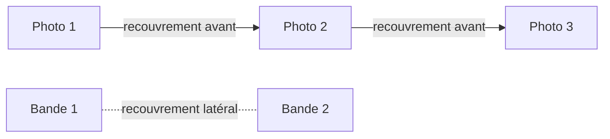

L'onglet **GÉOMÉTRIE** règle la façon dont les bandes de vol recouvrent la zone : de combien les photos se chevauchent, dans quelle direction les bandes sont tracées et quelles marges sont ajoutées autour de la zone. C'est ici qu'on ajuste la densité de la mission sans toucher au capteur ni à l'altitude.

## Comment l'ouvrir

<Steps>
  <Step title="Sélectionner une tâche">
    Ouvrez la mission, puis le vol concerné par l'onglet de vol en haut. Cliquez sur la tâche (la zone dessinée) dans le panneau **Tâches**.
  </Step>
  <Step title="Ouvrir l'onglet GÉOMÉTRIE">
    Dans le panneau, cliquez sur l'onglet **GÉOMÉTRIE**, à droite de **VOL** et **CAPTEUR**.
  </Step>
  <Step title="Régler les valeurs">
    Saisissez une valeur dans le champ, ou déplacez le curseur quand il existe. Les bandes sur la carte se recalculent avec la nouvelle valeur.
  </Step>
</Steps>

<Frame caption="Onglet GÉOMÉTRIE">
  
</Frame>

## Recouvrement avant et latéral

Un drone ne prend pas une seule photo : il en prend une toutes les quelques mètres, et les bandes sont voisines les unes des autres. Le recouvrement indique la part de chaque image qui se retrouve dans la suivante. Plus le recouvrement est élevé, plus il y a de photos et plus la mission est longue, mais l'assemblage (la mosaïque, le modèle 3D) est plus solide.

| Champ | Ce qu'il règle | Unité | Valeur affichée par défaut |
|---|---|---|---|
| **Recouvrement avant** | Chevauchement entre deux photos successives, le long d'une même bande | % | 80 % |
| **Recouvrement latéral** | Chevauchement entre deux bandes voisines | % | 60 % |

Vue simplifiée d'une bande :

<Note>
  Selon le type de capteur choisi dans l'onglet **CAPTEUR**, les libellés peuvent devenir **Recouvrement avant (photo)**, **Recouvrement latéral (photo)** ou **Recouvrement latéral (LiDAR)**. Le rôle reste le même.
</Note>

<Tip>
  Les valeurs par défaut affichées sont **80 %** (avant) et **60 %** (latéral).
</Tip>

## Direction et bouton AUTO

- Le curseur **Direction** fait tourner l'orientation des bandes sur la zone. Le champ à droite affiche la valeur numérique.
- Le bouton vert **AUTO**, à côté de **Direction**, laisse Helix proposer l'orientation.
- Pour régler l'orientation vous-même, utilisez le curseur ou le champ de valeur. Comparez les résultats dans l'encart **Durée / Distance**.

## Buffer AOI et Overshoot

Ces deux champs s'expriment en mètres (**m**) et valent **0** par défaut, donc aucune marge n'est ajoutée :

- **Buffer AOI** : marge autour de la zone dessinée.
- **Overshoot** : distance ajoutée au-delà des extrémités des bandes.

## Double grille

Le bouton **Double grille** active une seconde série de bandes. Sur la carte, les bandes forment alors une grille à deux familles de lignes.

## Zone stricte

Le bouton **Zone stricte** cadre les bandes sur le contour tracé. Vérifiez la carte après l'avoir activé ou désactivé.

## Effet visible sur les bandes

Après chaque changement, la carte se met à jour et la liste **BANDES** change :

- un recouvrement plus élevé rapproche les bandes et augmente leur nombre ;
- une marge (**Buffer AOI**, **Overshoot**) étend la zone couverte par les bandes ;
- **Double grille** ajoute une seconde série de bandes croisée avec la première ;
- **Zone stricte** change le cadrage des bandes par rapport au contour.

Vérifiez le résultat dans l'encart **Durée / Distance** et dans la liste **BANDES** avant d'exporter le plan de vol.

{/* CAPTURE À FAIRE : onglet GÉOMÉTRIE avec Double grille activée et bandes croisées visibles sur la carte */}

## Voir aussi

- [Altitude, GSD et vitesse (onglet VOL)](/fr/flight-planner/parametres/onglet-vol)
- [Choisir le capteur (onglet CAPTEUR)](/fr/flight-planner/parametres/onglet-capteur)
- [Les bandes de vol](/fr/flight-planner/parametres/bandes)
- [Contrôle qualité (QC)](/fr/flight-planner/qualite/controle-qualite)
